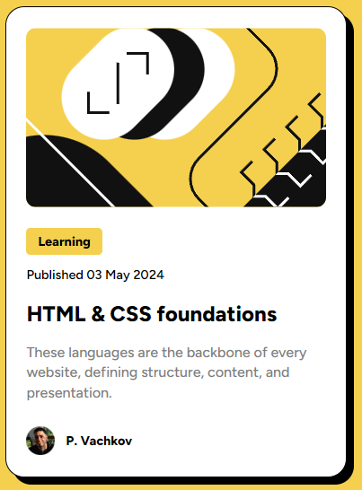
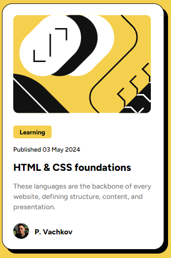

# Frontend Mentor - Blog preview card solution

This is a solution to the [Blog preview card challenge on Frontend Mentor](https://www.frontendmentor.io/challenges/blog-preview-card-ckPaj01IcS).

## Table of contents

- [Overview](#overview)
  - [The challenge](#the-challenge)
  - [Screenshot](#screenshot)
  - [Links](#links)
- [My process](#my-process)
  - [Built with](#built-with)
  - [What I learned](#what-i-learned)
  - [Continued development](#continued-development)
- [Author](#author)

## Overview

### The challenge

Users should be able to:

- See hover and focus states for all interactive elements on the page

### Screenshot

### Links

- Solution URL: [Repo](https://github.com/zh4r/FeM-blog-preview-card.git)
- Live Site URL: [GitHub.io](https://zh4r.github.io/FEM/blog-preview-card/index.html)

## My process

### Built with

- Semantic HTML5 markup
- CSS/SCSS
- CSS Grid
- Mobile-first workflow

### What I learned

I've either gone overboard with semantics, or I've completely messed them up...

### Continued development

- I'm in a fierce battle with semantic HTML, and will continue to study the enemy's fundamentals, eventually making me victorious in the Accessibility war!
- I have to dive deeper into CSS animations, because they're fun!

## Author

- Website - [zh4r.GitHub.io](https://zh4r.github.io/)
- GitHub - [@zh4r GitHub](https://github.com/zh4r)
- Frontend Mentor - [@zh4r](https://www.frontendmentor.io/profile/zh4r)
