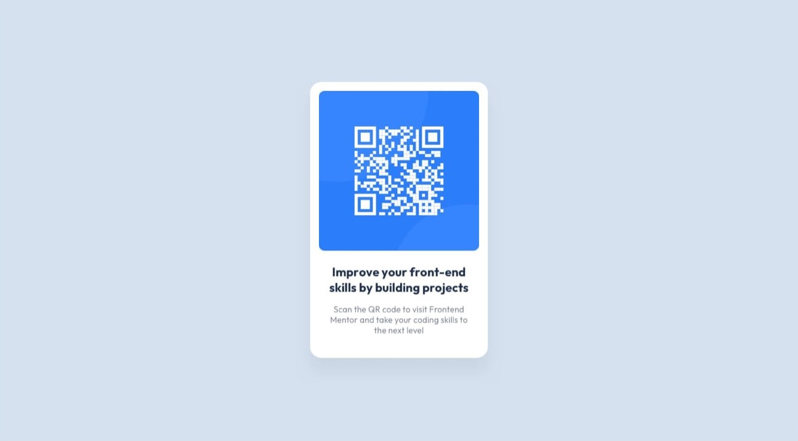
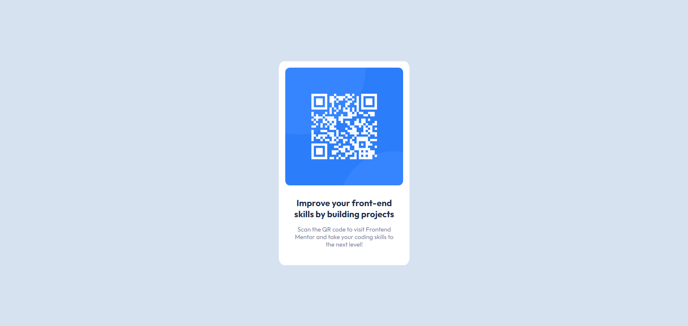
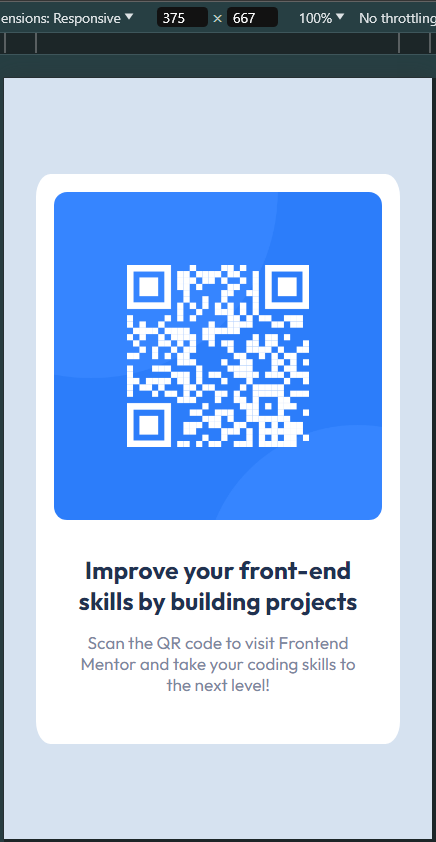

# Frontend Mentor - QR code component solution

This is a solution to the [QR code component challenge on Frontend Mentor](https://www.frontendmentor.io/challenges/qr-code-component-iux_sIO_H).

## Table of contents

- [Overview](#overview)
  - [Screenshots](#screenshots)
  - [Links](#links)
- [My process](#my-process)
  - [Built with](#built-with)
  - [What I learned](#what-i-learned)
- [Author](#author)

## Overview
1st FE Mentor exercise. Testing the waters.

Starter Code preview:\

### Screenshots
Solution desktop preview:\

Solution mobile preview:\

### Links

- Solution URL: [QR Component github.io](https://zh4r.github.io/FEM/qr-code)

## My process
Decided to use as little as possible to achieve the needed result. Still learning, so there's probably a lot I could've done differently to make the solution even simpler. Still happy with it, though.

### Built with

- HTML5
- CSS custom properties
- Flexbox

### What I learned

How to center a `
` :)

## Author

- Website - [zh4r.github.io](https://zh4r.github.io/)
- Frontend Mentor - [@zh4r](https://www.frontendmentor.io/profile/zh4r)
