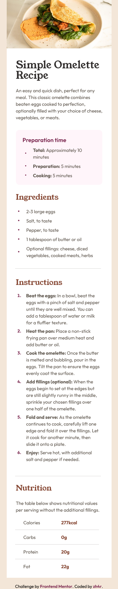
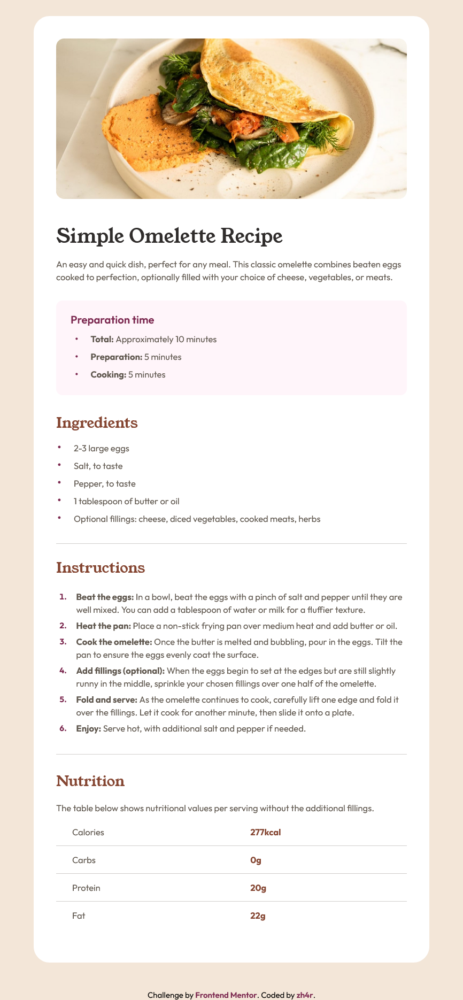

# Frontend Mentor - Recipe page solution

This is a solution to the [Recipe page challenge on Frontend Mentor](https://www.frontendmentor.io/challenges/recipe-page-KiTsR8QQKm).

## Table of contents

- [Overview](#overview)
  - [Screenshot](#screenshot)
  - [Links](#links)
- [My process](#my-process)
  - [Built with](#built-with)
  - [What I learned](#what-i-learned)
  - [Continued development](#continued-development)
- [Author](#author)

## Overview

### Screenshot

Mobile             |  Desktop
:-------------------------:|:-------------------------:
|  

### Links

- Solution URL: [Repo](https://github.com/zh4r/FeM-recipe-page)
- Live Site URL: [GitHub Pages](https://zh4r.github.io/FEM/recipe-page/index.html)

## My process

### Built with

- Semantic HTML5 markup
- CSS custom properties
- CSS Grid

### What I learned

- The correlation between `padding` and `border-radius` was an interesting read.
- A lot about lists behaviour.

### Continued development

- I would love to streamline my process in some way, because this challenge took me way to much time.
- I couldn't understand why the `1` in the `<ol>` decided to be a different font than the other `Outfit` font `1`s...

## Author

- Portfolio (*coming soon*) - [zh4r.me](https://zh4r.me)
- Frontend Mentor - [@zh4r](https://www.frontendmentor.io/profile/zh4r)
