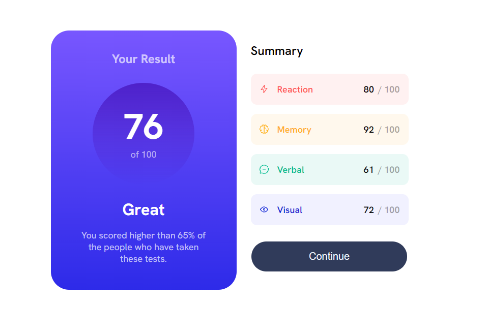

# Frontend Mentor - Results summary component solution

This is a solution to the [Results summary component challenge on Frontend Mentor](https://www.frontendmentor.io/challenges/results-summary-component-CE_K6s0maV). Frontend Mentor challenges help you improve your coding skills by building realistic projects. 

## Table of contents

- [Overview](#overview)
  - [The challenge](#the-challenge)
  - [Screenshot](#screenshot)
  - [Links](#links)
- [My process](#my-process)
  - [Built with](#built-with)
  - [What I learned](#what-i-learned)
  - [Continued development](#continued-development)
  - [Useful resources](#useful-resources)
- [Author](#author)

## Overview

### The challenge

Users should be able to:

- View the optimal layout for the interface depending on their device's screen size
- See hover and focus states for all interactive elements on the page
- **Bonus**: Use the local JSON data to dynamically populate the content

### Screenshot

#### Mobile & Desktop

### Links

- Solution URL: [Repo](https://github.com/zh4r/FeM-results_summary)
- Live Site URL: [GitHub Pages](https://zh4r.github.io/FEM/results-summary/index.html)

## My process
### Built with

- Semantic HTML5 markup
- CSS custom properties
- Flexbox
- CSS Grid
- Mobile-first workflow
- JSON

### What I learned

- Keyframe animations
- How to transition a gradient (button hover effect)
- Still getting the hang of `position` & `display`. Those two feel like behemoths in CSS. You get them down - you're good.

### Continued development

I want to:
- Dive deeper into `position` & `display`.
- Understand JSON better.

## Author

- Website - [zh4r @ GitHub Pages](https://zh4r.github.io/)
- Frontend Mentor - [@zh4r](https://www.frontendmentor.io/profile/zh4r)
- Freelancing - [Upwork](https://www.upwork.com/freelancers/~012011fab05dc8d091?mp_source=share)