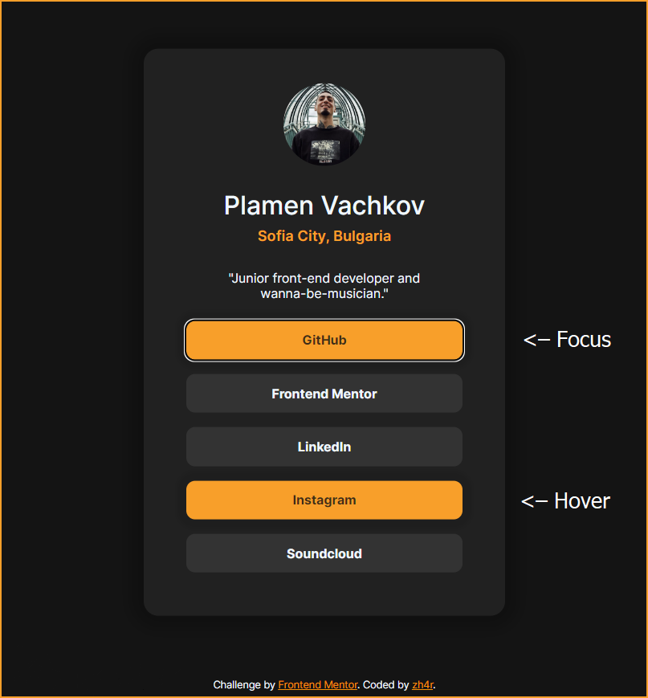

# Frontend Mentor - Social links profile solution

This is a solution to the [Social links profile challenge on Frontend Mentor](https://www.frontendmentor.io/challenges/social-links-profile-UG32l9m6dQ).

## Table of contents

- [Overview](#overview)
  - [The challenge](#the-challenge)
  - [Screenshot](#screenshot)
  - [Links](#links)
- [My process](#my-process)
  - [Built with](#built-with)
  - [What I learned](#what-i-learned)
  - [Continued development](#continued-development)
- [Author](#author)

## Overview

### The challenge

Users should be able to:

- *See hover and focus states for all interactive elements on the page.*

### Screenshot

### Links

- [GitHub Repo](https://github.com/zh4r/FeM-soc-links)
- [Live Preview](https://zh4r.github.io/FEM/social-links-tree/index.html)

## My process
This challenge, I wanted to focus on accessability and SEO practices, as I am not very familiar with either, and I would love some feedback on how well I did on both. 

Decided to change the accent color to a warmer one, because I like it better.

Added subtle shadows and animations to give it more character! 

### Built with

- HTML5
- CSS
- Flexbox

### What I learned
- I familiarized myself with aria labels and meta tags.

- Learned about the `:focus` selector.

- *Somewhere along the way, I got side-tracked into changing emmet defaults, which spiraled into a few hours of emmet rabbit hole exploration.*

### Continued development

I want to continue teaching myself good SEO practices and make my pages as accessible as possible!

## Author

- Website - [zh4r.github.io](https://zh4r.github.io/)
- Frontend Mentor - [@zh4r](https://www.frontendmentor.io/profile/zh4r)
